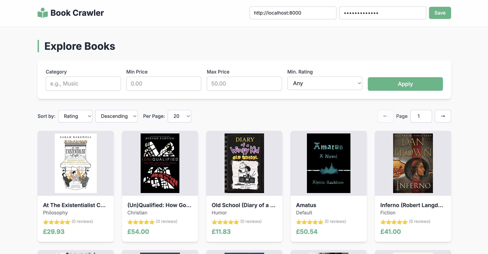
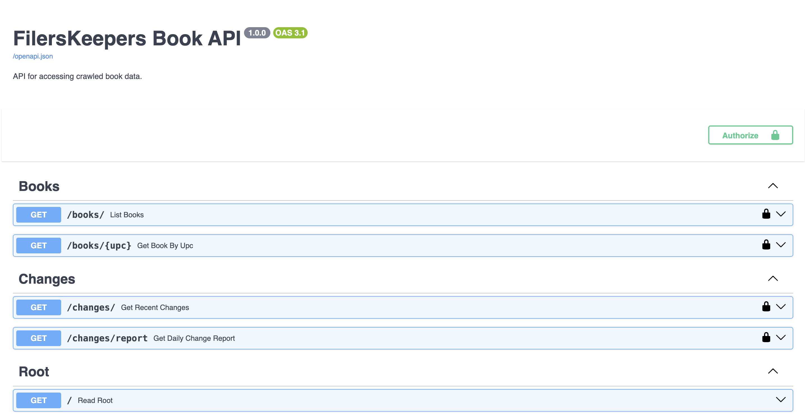
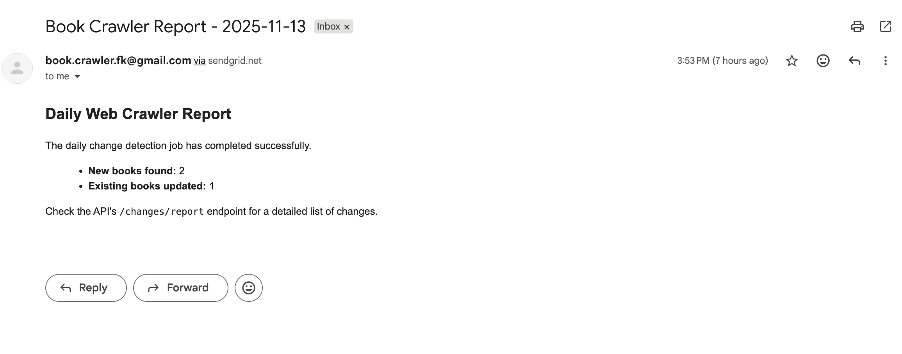

# Book Crawler

This project is a comprehensive, production-ready web crawling solution designed to scrape, monitor, and serve data from the e-commerce site [books.toscrape.com](http://books.toscrape.com).

It consists of three main, independent services:

1.  **Crawler:** A robust, async, and resumable crawler that scrapes all book data and saves it to MongoDB.
2.  **Scheduler:** A daily-running service that checks for data changes (new books, price updates, etc.), logs these changes, and sends an email alert.
3.  **API:** A secure, rate-limited, and feature-rich FastAPI server to query the collected book data and change logs.

## Features

This solution is composed of three distinct, high-performance services:

  * **Asynchronous Crawler:** The core of the project is a scalable, async-first crawler built with `httpx` and `asyncio`. It features robust error handling, including automatic retries on transient network errors (via `httpx`) and 5xx server errors (via `tenacity`). The crawler is resumable, automatically skipping books already present in the database to prevent redundant work. Scraped data is validated against a Pydantic model (`Book`) and stored in MongoDB, including a full raw HTML snapshot for data integrity.

  * **Intelligent Change Scheduler:** A daily `APScheduler` job monitors the target site for changes. It efficiently discovers new books and identifies updates to existing ones using a `data_fingerprint` (a content hash) for comparison. All detected changes (new books, price changes, availability, etc.) are recorded in a dedicated `change_log` collection in the database. Upon detecting any changes, the service can be configured to dispatch email alerts via SendGrid.

  * **Secure & Performant API:** A production-ready API, built with `FastAPI`, serves the collected data. It provides secure, hashed `bcrypt` API key authentication and is protected against abuse with a `slowapi` rate limiter (100 requests/hour). The API offers:

      * `GET /books`: A powerful endpoint with pagination and support for filtering by category, price, and rating, as well as sorting by price, rating, or number of reviews.
      * `GET /books/{upc}`: Retrieves full details for a single book.
      * `GET /changes` & `/changes/report`: Endpoints to view the recent change log, with the report endpoint offering both JSON and CSV export formats.

The project also includes a comprehensive test suite with unit and integration tests (using `pytest`), a frontend demo client, and a full-featured test runner script (`run_tests.sh`).

## Tech Stack

  * **Language:** Python 3.10+
  * **API:** FastAPI, Uvicorn
  * **Crawler:** HTTPO, Parsel, Tenacity
  * **Database:** MongoDB (using `motor` for async)
  * **Scheduling:** APScheduler
  * **Data Validation:** Pydantic
  * **Security:** `bcrypt` (for hashes), `passlib`, `slowapi`
  * **Testing:** Pytest, pytest-asyncio, pytest-httpx
  * **Email:** SendGrid

## Running the Book Crawler

### 1\. Prerequisites

  * Python 3.10 or newer.
  * A running **MongoDB** instance. You can use a free cloud-hosted instance from [MongoDB Atlas](https://www.google.com/search?q=https://www.mongodb.com/try/atlas-signup) or run it locally via Docker (`docker run -d -p 27017:27017 mongo`).

### 2\. Setup

1.  **Clone the repository:**

    ```
    git clone [https://github.com/your-username/webcrawler.git](https://github.com/your-username/webcrawler.git)
    cd webcrawler
    ```

2.  **Create and activate a virtual environment:**

    ```
    python -m venv venv
    source venv/bin/activate
    # On Windows: .\venv\Scripts\activate
    ```

3.  **Install dependencies:**

    ```
    pip install -r requirements.txt
    ```

### 3\. Configuration

1.  **Create your `.env` file:** Copy the example file to create your local configuration.

    ```
    cp .env.example .env
    ```

2.  **Edit your `.env` file:**

      * `MONGODB_URI`: Set your MongoDB connection string.
          * Example: `mongodb://localhost:27017/`
      * `MONGODB_DB_NAME`: Set your database name.
          * Example: `filerskeepers`
      * `VALID_API_KEY_HASHES`: This is for your secret API key. Do *not* put the key here directly.

3.  **Generate your API Key Hash:** First, choose a strong secret key (e.g., `my-secret-key-12345`). Then, use the provided script to hash it:

    ```
    python generate_hash.py my-secret-key-12345
    ```

    The script will output a long hash string starting with `$2b$`. Copy this *entire hash* and paste it into `VALID_API_KEY_HASHES` in your `.env` file.

4.  **(Optional) Configure Email Alerts:**

      * Sign up for a free [SendGrid](https://sendgrid.com/) account.
      * Get your API key and verify a Sender Email.
      * Fill in `SENDGRID_API_KEY`, `ALERT_SENDER_EMAIL`, and `ALERT_RECIPIENT_EMAIL` in your `.env` file.

## Usage

You will run each of the three services in separate terminal windows.

### 1\. Run the Initial Crawl

First, you must populate the database. Run the main crawler script. This will scrape all books from the site and save them.

```
python -m crawler.main
```

This may take a few minutes. You only need to do this once.

### 2\. Run the API Server

Start the FastAPI server. This will make your data available via the REST API.

```
uvicorn api.main:app --reload
```

The API will be available at `http://127.0.0.1:8000`. You can view the documentation at `http://127.0.0.1:8000/docs`.

### 3\. Run the Scheduler

Start the scheduler service. This will run in the foreground and execute the change detection job every day at 3:00 AM (OPTIONAL: once on startup for testing).

```
python -m scheduler.main
```

## Testing

This project includes a comprehensive test suite. You can run all tests using the provided shell script.

```
# Make the script executable
chmod +x run_tests.sh

# Run all tests
./run_tests.sh --all

# Run tests with coverage report
./run_tests.sh --coverage

# Run only the API tests
./run_tests.sh --api
```

## Demo Frontend

A simple HTML/JS frontend client is provided in `frontend/index.html`.

To use it, open the file in your browser, enter your API Base URL (`http://127.0.0.1:8000`) and the *plain-text* secret key (e.g., `my-secret-key-12345`), and click "Save". You can then browse, filter, and search for books.

## API Documentation (Swagger UI)

The API is self-documenting. Once the API server is running (with `uvicorn api.main:app`), the interactive Swagger UI is available at:

[**http://127.0.0.1:8000/docs**](https://www.google.com/search?q=http://127.0.0.1:8000/docs)

You can test all endpoints from this UI. Remember to click the "Authorize" button and enter your *plain-text* API key (e.g., `my-secret-key-12345`) to authenticate your requests.

**Screenshot of Swagger UI:** 


## Sample MongoDB Document Structure

Here is an example of a single `book` document from the `books` collection in MongoDB.

```
{
  "_id": {
    "$oid": "674e1d3a5a4c9b1e3f2a8c6d"
  },
  "upc": "a897fe39b1053632",
  "name": "A Light in the Attic",
  "description": "It's hard to imagine a world without A Light in the Attic, from the author of The Giving Tree. This classic collection of poetry and drawings is one of Shel Silverstein's most ...",
  "category": "Poetry",
  "price_incl_tax": 51.77,
  "price_excl_tax": 51.77,
  "availability": "In stock (22 available)",
  "num_reviews": 0,
  "rating": 3,
  "image_url": "[https://books.toscrape.com/media/cache/2c/da/2cdad67c44b002e7ead0cc35693c0e8b.jpg](https://books.toscrape.com/media/cache/2c/da/2cdad67c44b002e7ead0cc35693c0e8b.jpg)",
  "source_url": "[https://books.toscrape.com/catalogue/a-light-in-the-attic_1000/index.html](https://books.toscrape.com/catalogue/a-light-in-the-attic_1000/index.html)",
  "crawl_status": "successful",
  "crawl_timestamp": {
    "$date": "2025-10-28T14:30:18.123Z"
  },
  "data_fingerprint": "a1b2c3d4e5f6...",
  "raw_html_snapshot": "<html>...</html>"
}
```

And here is an example of a `change` document from the `change_log` collection:

```
{
  "_id": {
    "$oid": "674e1d3b5a4c9b1e3f2a8c6e"
  },
  "book_upc": "f0a1c6981cf31fde",
  "timestamp": {
    "$date": "2025-10-29T03:00:10.456Z"
  },
  "field_changed": "price_incl_tax",
  "old_value": "23.88",
  "new_value": "25.00"
}
```

## Logs of Successful Runs

#### 1\. Initial Crawler Run


```
2025-11-13 23:17:22 - utils.database - INFO - Setting up database indexes...
2025-11-13 23:17:24 - utils.database - INFO - Database indexes are set.
2025-11-13 23:17:25 - __main__ - INFO - Fetching existing URLs to resume crawl...
2025-11-13 23:17:25 - __main__ - INFO - Found 0 existing books in database.
2025-11-13 23:17:25 - __main__ - INFO - Starting stage 1: discover books
2025-11-13 23:17:27 - __main__ - INFO - Crawled list page 1. Found 20 books.
2025-11-13 23:17:28 - __main__ - INFO - Crawled list page 2. Found 20 books.
2025-11-13 23:17:29 - __main__ - INFO - Crawled list page 3. Found 20 books.
2025-11-13 23:17:30 - __main__ - INFO - Crawled list page 4. Found 20 books.
2025-11-13 23:17:30 - __main__ - INFO - Crawled list page 5. Found 20 books.
2025-11-13 23:17:31 - __main__ - INFO - Crawled list page 6. Found 20 books.
2025-11-13 23:17:32 - __main__ - INFO - Crawled list page 7. Found 20 books.
2025-11-13 23:17:33 - __main__ - INFO - Crawled list page 8. Found 20 books.
.
.
.
2025-11-13 23:18:30 - __main__ - INFO - Successfully saved book: The Alien Club
2025-11-13 23:18:30 - __main__ - INFO - Successfully saved book: Chase Me (Paris Nights #2)
2025-11-13 23:18:31 - __main__ - INFO - Successfully saved book: Silence in the Dark (Logan Point #4)
2025-11-13 23:18:31 - __main__ - INFO - Successfully saved book: What Happened on Beale Street (Secrets of the South Mysteries #2)
2025-11-13 23:18:31 - __main__ - INFO - Successfully saved book: Born to Run: A Hidden Tribe, Superathletes, and the Greatest Race the World Has Never Seen
2025-11-13 23:18:31 - __main__ - INFO - Successfully saved book: Last One Home (New Beginnings #1)
2025-11-13 23:18:31 - __main__ - INFO - Successfully saved book: Ender's Game (The Ender Quintet #1)
2025-11-13 23:18:31 - __main__ - INFO - Successfully saved book: The Emerald Mystery
2025-11-13 23:18:31 - __main__ - INFO - Successfully saved book: Red: The True Story of Red Riding Hood
2025-11-13 23:18:31 - __main__ - INFO - Successfully saved book: Aladdin and His Wonderful Lamp
2025-11-13 23:18:31 - __main__ - INFO - Crawl complete.
```

#### 2\. Scheduler Run (Detecting Changes)

Output from running `python -m scheduler.main` after manually changing a price (and the fingerprint) on the in the DB:

```
2025-11-13 23:25:42 - __main__ - INFO - Starting scheduler service...
2025-11-13 23:25:42 - apscheduler.scheduler - INFO - Adding job tentatively -- it will be properly scheduled when the scheduler starts
2025-11-13 23:25:42 - apscheduler.scheduler - INFO - Added job "Daily Book Change Detection" to job store "default"
2025-11-13 23:25:42 - apscheduler.scheduler - INFO - Scheduler started
2025-11-13 23:25:42 - apscheduler.scheduler - INFO - Removed job 73da3607ffe5496c8b535f8f2bc3e9ed
2025-11-13 23:25:42 - apscheduler.executors.default - INFO - Running job "run_daily_change_detection (trigger: date[2025-11-13 23:25:42 +06], next run at: 2025-11-13 23:25:42 +06)" (scheduled at 2025-11-13 23:25:42.407881+06:00)
2025-11-13 23:25:42 - scheduler.tasks - INFO - Starting daily change detection job...
2025-11-13 23:25:42 - scheduler.tasks - INFO - Running discovery phase to find all current books...
2025-11-13 23:26:29 - scheduler.tasks - INFO - Discovery complete. Found 1000 books on site.
2025-11-13 23:26:29 - scheduler.tasks - INFO - Running update phase to check for changes...
2025-11-13 23:26:32 - scheduler.tasks - INFO - Found 999 books in database.
2025-11-13 23:26:32 - scheduler.tasks - INFO - Found 1 new books. Crawling them...
2025-11-13 23:26:33 - scheduler.tasks - INFO - Saved new book: Trespassing Across America: One Man's Epic, Never-Done-Before (and Sort of Illegal) Hike Across the Heartland
2025-11-13 23:26:33 - scheduler.tasks - INFO - Checking 999 existing books for updates...
2025-11-13 23:26:33 - scheduler.tasks - WARNING - Change detected for UPC: d30b9215c72cca87
2025-11-13 23:26:33 - scheduler.tasks - INFO - Logged 1 changes for UPC d30b9215c72cca87.
2025-11-13 23:26:52 - scheduler.tasks - INFO - Changes detected. Sending email alert...
2025-11-13 23:26:52 - utils.email - INFO - Attempting to send email alert to saifsearcher@gmail.com...
2025-11-13 23:26:53 - utils.email - INFO - Successfully sent email alert. Status code: 202
2025-11-13 23:26:53 - scheduler.tasks - INFO - Daily change detection job complete.
2025-11-13 23:26:53 - apscheduler.executors.default - INFO - Job "run_daily_change_detection (trigger: date[2025-11-13 23:25:42 +06], next run at: 2025-11-13 23:25:42 +06)" executed successfully
```
And an email like this is sent to the recipient address:
